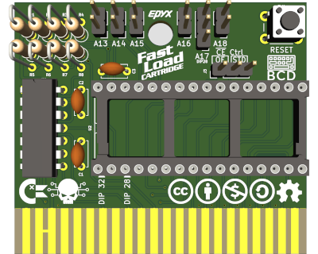
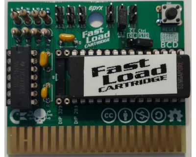
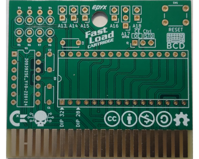

# Epyx FastLoad Cartridge

# Introduction

An open-source recreation of the Epyx FastLoad cartridge, this board can be used to repair a broken cartridge or build your own one. The main difference with other design are compatibility with 28 and 32 pin rom chips and bank configurability to allow multiple versions of the FastLoad rom to be installed on one cartridge.

# Compatibility

Since the design is almost identical to the original cartridge, it should have the same level of compatibility than the original FastLoad cartridge.

# Configuration

Unless dealing with special cases or custom software, J3 should be set to STD. A17 control the size of the of the EPROM, for 28 pin rom, short pin 1/2 or for 32 pin rom position 2-3 is used for bank switching.

## Bank Switching example

|A13|A14|A15|A16|A17|A18| Start of Bank |
|---|---|---|---|---|---|---------------|
|   |   |   |   |   |   |0x00000-0x01FFF|
| X |   |   |   |   |   |0x02000-0x03FFF|
|   | X |   |   |   |   |0x04000-0x05FFF|
| X | X |   |   |   |   |0x06000-0x07FFF|
|   |   | X |   |   |   |0x08000-0x09FFF|
| X |   | X |   |   |   |0x0A000-0x0BFFF|
|   | X | X |   |   |   |0x0C000-0x0DFFF|
| X | X | X |   |   |   |0x0E000-0x0FFFF|
...
|   |   |   | X |   |   |0x10000-0x11FFF|
...
|   |   |   |   | X |   |0x20000-0x21FFF|
...
|   |   |   | X | X |   |0x30000-0x31FFF|
...
|   |   |   |   |   | X |0x40000-0x41FFF|
...
|   |   |   | X |   | X |0x50000-0x51FFF|
...
|   |   |   |   | X | X |0x60000-0x61FFF|
...
|   |   |   | X | X | X |0x70000-0x71FFF|
...
| X | X | X | X | X | X |0x7E000-0x7FFFF|
| X |   | X | X | X | X |0x7A000-0x7FFFF|
|   | X | X | X | X | X |0x7C000-0x7CFFF|
| X | X | X | X | X | X |0x7E000-0x7FFFF|

# Components and assembly

[Gerbers files](Gerbers/) are available for uploading to your prefered manufacturer (I personnally use JLCPCB). In adition to the PCB, a few components must be sourced. If you want to save a few cents, R1-8 can all be 2K7 (Anything over 1K will probably work just fine too). As usual, start with the smallest components and build up (in this case, the sockets and capacitors are probably the smallest height you will have).

|Designator|Value                                |Total Quantity|
|----------|-------------------------------------|--------------|
|C1        |Ceramic Capacitor 470nF              |1             |
|C2-C3     |Ceramic Capacitor 100nF              |2             |
|R1-R7     |10K Resistor                         |7             |
|R8        |2K7 Resistor                         |1             |
|U1        |74LS07 DIP 14                        |1             |
|          |Optional DIP 14 Socket (7.62mm Wide) |1 (Optional)  |
|U2        |DIP 32 Socket (15.24mm Wide)         |1             |
|          |DIP28/32 EPROM                       |1             |
|SW1       |Push button momentary 6mm            |1             |

Once everything is assembled, program your eprom with the correct [rom image](Roms/), configure the board and you're done.

# Epyx FastLoad Manual

For reference, the Epyx FastLoad manual is available [here](Manual/).

# Licence

This work is licensed under the Creative Commons Attribution-NonCommercial-ShareAlike 4.0 International License. To view a copy of this license, visit http://creativecommons.org/licenses/by-nc-sa/4.0/ or send a letter to Creative Commons, PO Box 1866, Mountain View, CA 94042, USA.
